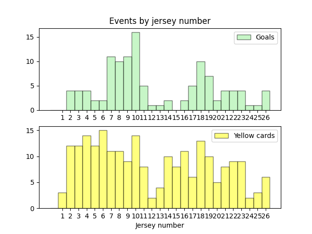

Basic setup using Python


```python
import csv
import matplotlib.pyplot as plt
import numpy as np
import matplotlib

matplotlib.use('TkAgg')

CSV_PATH = '2024.csv'
```

General functions necessary for the following analysis


```python
def load_csv(csv_path):
    """Load a CSV file and return two lists: events and players"""
    events = []
    players = []
    
    with open(csv_path, encoding='latin-1') as csv_f:
        fixed_data = csv_f.read().replace('nan', 'None') # Preprocess data from csv-file
        reader = csv.reader(fixed_data.splitlines())
        
        headers = next(reader) # Skip the header
        for row in reader:
            events += eval(row[-1])
            players += eval(row[-4]) # Add teams from "home" games
            players += eval(row[-5]) # Add teams from "away" games
            
    # So far, the "players" list contains multiple copies of the same players from different games;
    # Fix it by putting the players into a dictionary by ID, thus overwriting duplicates
    players_dict = {i['id_player']: i for i in players}
    players = players_dict.values()
    
    # We're only interested in events related to a person (e.g. "goal", "card"). Remove the rest
    events = [i for i in events if i['primary_id_person'] is not None]
    
    return events, players

def find_player_by_id(players, player_id):
    """Return the player corresponding to the specified player ID"""
    return [i for i  in players if i['id_player'] == player_id][0]

def filter_events_by_type(all_events, event_type):
    """Return a list of events with only a given type (e.g. 'Goal')"""
    return [i for i in all_events if i['type'] == event_type]
```

Now let's run the function def load_csv(csv_path) to load data from the file:


```python
events, players = load_csv(CSV_PATH)
```

Counting goals by body part


```python
def count_goals_by_body_part(goal_events):
    """Take goal events and count the number of goals per body part; return as a dict"""
    result = {}
    for event in goal_events:
        body_part = event.get('body_part')
        if body_part:
            result[body_part] = result.get(body_part, 0) + 1
    return result

```

Function for displaying the pie chart


```python
def show_body_part_pie_chart(body_parts_count):
    """Plot and show a pie chart of goals by body part"""
    colors = ['#AE1DF4', '#01E08F', '#7463FF', '#111111']
    
    plt.pie(
        body_parts_count.values(),
        labels=body_parts_count.keys(),
        autopct='%1.1f%%',
        textprops={'color': '#333333'},
        colors=colors[:len(body_parts_count)] # Adjust colors list length
    )
    plt.title('Goals per body part')
    plt.show()
```

Running the functions


```python
plt.figure(figsize=(6, 6), dpi=130)
goal_events = filter_events_by_type(events, 'GOAL')
body_parts_count = count_goals_by_body_part(goal_events)
show_body_part_pie_chart(body_parts_count)
```

You should see a pie chart after the execution of the code above ^


---

Next, we looked at goals scored by players based on their jersey numbers. Do players with certain 
numbers tend to score more goals? Let's find out.

Preparing the functions


```python
def get_jerseys_numbers_by_event(events, players, event_type):
    """Return a simple list of jersey numbers corresponding to events of specified event_type"""
    
    selected_events = filter_events_by_type(events, event_type)
    
    # Helper function to find a player by ID and return his number
    def jersey_num_by_id(player_id):
        return find_player_by_id(players, player_id)['jersey_namber']
    
    return [jersey_num_by_id(i['primary_id_person']) for i in selected_events]

def plot_jerseys_numbers_histogram(jerseys_list, data_label, data_color):
    """Plot the jersey histogram based on 'jerseys_list' data"""
    MAX_JERSEY_NUMBER = 26
    _, bins, _ = plt.hist(
        jerseys_list,
        bins=np.arange(MAX_JERSEY_NUMBER + 2) - 0.5,
        label=data_label,
        edgecolor='black',
        color=data_color,
        alpha=0.5
    )
    plt.xticks(0.5 * (bins[1:-1] + bins[2:])) # Make sure all numbers are labeled on x-axis
    plt.legend()
```

Running the functions and displaying the histogram


```python
goals_jerseys = get_jerseys_numbers_by_event(events, players, 'GOAL')
cards_jerseys = get_jerseys_numbers_by_event(events, players, 'YELLOW_CARD')

plt.subplot(2, 1, 1) # Top plot
plt.title('Events by jersey number')
plot_jerseys_numbers_histogram(goals_jerseys, 'Goals', 'lightgreen')

plt.subplot(2, 1, 2) # Bottom plot
plt.xlabel('Jersey number')
plot_jerseys_numbers_histogram(cards_jerseys, 'Yellow cards', 'yellow')

plt.show()
```


